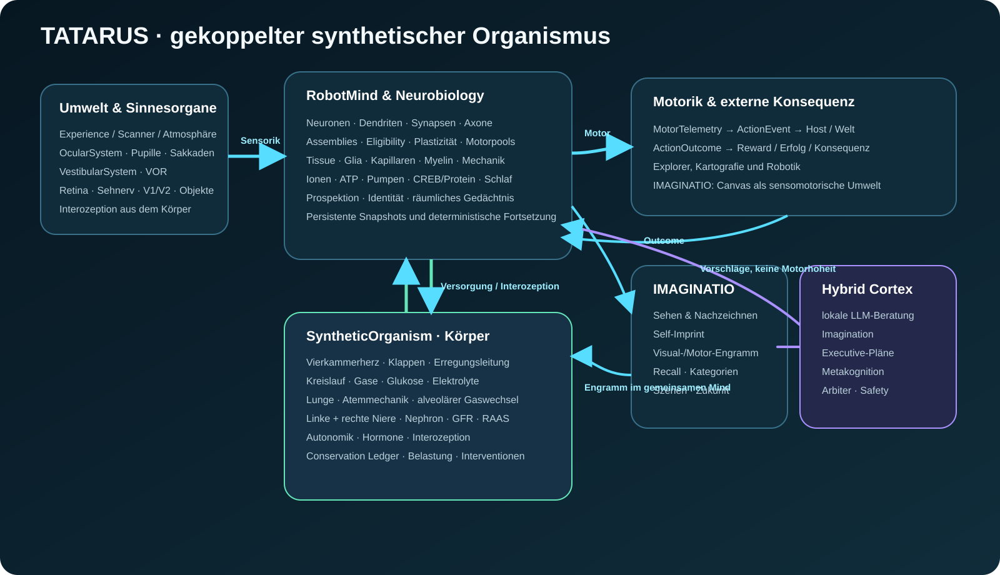

# TATARUS 4 - Synthetic Organism & Embodied Intelligence SDK

**Version 4.0.0 · GPL-3.0 · Dokumentationsstand 8. September 2026**

TATARUS verbindet ein persistentes räumliches Nervensystem mit Herz,
geschlossenem Blutkreislauf, Lunge und **zwei unabhängig berechneten Nieren**.
Sensorik, neuronale Dynamik, Organphysiologie, Interozeption, Gedächtnis,
Motorentscheidung und Handlungsergebnis laufen in einem gemeinsamen,
deterministisch reproduzierbaren Systemzustand.

> **Wissenschaftliche Einordnung:** Die Organmodule sind kausal gekoppelte,
> mechanistische und phänomenologische Rechenmodelle. Sie bilden ausgewählte
> physiologische Beziehungen ab, sind aber weder vollständige reale Biologie
> noch klinisch validierte digitale Organ-Zwillinge.

Die Live-Oberfläche startet mit 384 Neuronen. Umschaltbare Profile mit 96,
1.536 und 6.144 Neuronen bilden zwei Hemisphären, sechs funktionale Regionen,
vier kortikale Schichten und subkortikale modulatorische Kerne ab.


## Herunterladen

```powershell
git clone https://github.com/kruemmel-python/Tatarus-4.git
cd Tatarus-4
```

Alternativ auf GitHub **Code → Download ZIP** wählen und das Archiv entpacken.


## Neu in diesem Build: neuronales Orts- und Weggedächtnis

Dieser Stand enthält zusätzlich zur Throughput-Instrumentierung einen Fix für das
`neural_direct`-Training: räumliche Erfahrung wird jetzt als persistentes
Place-/Action-Engramm **innerhalb des Nervensystems** gehalten. Es gibt keine
CSV-/JSON-Besuchskarte als Lernspeicher und keinen versteckten Pfadplaner.

- allocentrischer, heading-unabhängiger Grid-/Place-Kontext aus der vorhandenen Zielvektor-Sensorik,
- persistente Place-Engramme mit Reward-, Novelty-, Frontier-, Success-, langfristigem Routenwert und Vermeidungswert je Bewegungsrichtung,
- TD(λ)-ähnliche Eligibility-Trace für rückwirkende Routen-/Erfolgskonsolidierung,
- vollständige neuronale Episodenspur; erfolglose Routen werden über `endEpisode(false)` als Fehlpfade konsolidiert, erfolgreiche Routen vor der Stabilisierung schleifenbereinigt,
- Recall wirkt als top-down dendritischer/Soma-Drive auf die echten vier Motor-Neuronenpools; `decodeAction()` bleibt reiner neuronaler Readout,
- Spatial-Memory wird im binären Nervensystem-Snapshot gespeichert; ältere Snapshots ohne Block bleiben lesbar und starten mit leerem Ortsgedächtnis,
- Live-Telemetrie zeigt zusätzlich gespeicherte Fehlpfade, langfristige Routenwerte und Vermeidungsstärke,
- Throughput-v3 zählt den neuen `spatial_memory`-Bereich mit.

Architektur und Wirkprinzip beschreibt das
[`Docs/manuals/systemhandbuch.html`](docs/manuals/systemhandbuch.html).

## Neu: Explorer-Kartografie für Rover und Drohnen

`RobotMind::observeExplorer()` verarbeitet Navigation und Vermessung im selben
deterministischen Sensorzyklus. Scannerstrahlen werden in eine persistente,
sparse 3D-Voxelmatrix fusioniert. Ein Bodenroboter nutzt dabei im Wesentlichen
die x/z-Ebene; eine Drohne kann dieselbe Karte vollständig dreidimensional
verwenden.

- unbekannte, freie, unsichere und belegte Bereiche mit kumulierter Evidenz,
- Sensorpose als 3D-Position plus Quaternion und beliebig viele Range-/LiDAR-Strahlen,
- optionale semantische Funde wie `basalt_rock`, `door` oder `water_ice`,
- getrennte Karten über `environmentId`, Weltkoordinaten-Abfrage und JSON-Export,
- Frontierzellen und lokale Neuheit als Explorationssignale für das Nervensystem,
- periodischer Grid-/Place-Code der realen Pose sowie lokale Hindernisnähe als
  neuronaler Eingang, jedoch ohne versteckten Pfadplaner,
- gemeinsame Snapshot-Persistenz in `environment_map.tcm`.

Ein vollständiges Marsrover-Beispiel befindet sich in
[`examples/explorer_rover.cpp`](examples/explorer_rover.cpp).
Architektur, API und Grenzen beschreibt
[`Docs/manuals/explorer-kartografie.html`](docs/manuals/explorer-kartografie.html).

## Neu: TATARUS IMAGINATIO V14 – Self-Imprint und Neural-Motor-Engramm

IMAGINATIO V14 trennt weiterhin strikt zwischen **äußerer Bildquelle** und
**persistenter eigener Erinnerung**, ergänzt aber den in V13 fehlenden
Konsolidierungsschritt. Während einer sichtbaren Lernlektion darf das
Trainingsbild sensorisch vorliegen und als transientes Teacher-Signal den
Malvorgang führen. Diese Source-Pixel und Teacher-Pigmentpatches werden nicht in
einem visuellen Engramm persistiert.

Nach dem erfolgreichen Nachzeichnen geschieht nun zusätzlich ein
**Self-Imprint-Pass**:

1. TATARUS beendet seine eigene Zeichnung auf der internen Leinwand.
2. Diese **selbst erzeugte Leinwand** wird erneut über Okularsystem, Retina,
   V1/V2 und ventralen Pfad wahrgenommen, solange die Lernplastizität für diese
   Episode noch aktiv ist.
3. Die dadurch aktivierte Self-Assembly wird mit dem Visual Engram gekoppelt.
4. Aus der eigenen ausgeführten Malhandlung wird ein persistentes
   **Neural-Motor-Engramm** gebildet.
5. Erst danach endet die Lernepisode.

Das V14-Engramm enthält damit zwei komplementäre Gedächtnisebenen:

- perzeptuelles Gedächtnis: Fingerprint, ShapeSignature, ObjectPartModel,
  Region-/Stroke-Struktur und Assembly-Bindungen;
- eigenes motorisches Gedächtnis: skalare RGB8-Malaktionen mit Position und
  Pigment, die aus **TATARUS' fertiger eigener Leinwand** konsolidiert werden.

Wichtig ist die technische Abgrenzung: V14 speichert weiterhin **kein
Source-Raster**, **keinen persistenten 8×8-Teacher-Patch-Trace** und auch den
aktuellen Arbeits-Canvas nicht im Snapshot. Das Self-Motor-Engramm ist jedoch
bewusst rekonstruktiv: Es enthält genügend Information, damit TATARUS seine
eigene zuvor gemalte 24-Bit-RGB-Ausgabe beim Recall wiederholen kann. Das ist
kein Anspruch auf informationsfreien 1:1-Recall – ein rekonstruierbares
Gedächtnis muss notwendigerweise entsprechende Information tragen.

Beim Recall wird zuerst das gekoppelte Engramm aktiviert. Wenn ein gültiges
Self-Motor-Engramm existiert, entsteht daraus ein interner Zielzustand und eine
frische serielle Malspur. Nach dem Malen sieht TATARUS seine eigene neue
Leinwand erneut über die Sehbahn; während dieses Recall-Checks ist Lernen
deaktiviert, damit keine selbstverstärkende Halluzinationsschleife entsteht.

Snapshots werden als **Version 14** geschrieben. V1–V13 bleiben lesbar. Alte
Snapshots können migriert werden, besitzen aber naturgemäß noch kein während
der ursprünglichen Lernepisode konsolidiertes V14-Self-Motor-Engramm. Für einen
hochpräzisen V14-Recall sollten die Bilder deshalb mit V14 neu gelernt werden.

Das Manifest weist die zentralen Invarianten aus:

```text
version=14
visual_memory_storage=self-consolidated-neural-motor-engram
teacher_trace_storage=transient-only
source_raster_retention=none
working_canvas_persisted=false
self_imprint=retina-v1-ventral-motor-coupled
self_motor_memory=scalar-rgb8-motor-strokes
```

## Neu: TATARUS IMAGINATIO

TATARUS kann eine echte 512×512-Farbleinwand mit vollständigem 24-Bit-sRGB als
Umwelt wahrnehmen und über zehn serielle Pinselaktionen sowie exakte, begrenzte
8×8-Pigmentstempel verändern. Alte 32×32-Grau- und RGB-Aufrufe sowie frühere
Snapshots bleiben kompatibel und werden deterministisch hochskaliert. Das integrierte Beispiel führt die
Grundstufen in einem einzigen Lauf aus: Nachzeichnen, visueller Gedächtnisabruf,
Symbol-Bild-Assoziation und die aktionsbasierte Kombination mehrerer
Erinnerungen. Stufe 5 bildet aus vielen Beispielen inkrementelle Kategorien
und malt neue Varianten aus laufender Form- und Feature-Statistik, Salienz und
zehn objektadaptiven Teilfeldern. Konkrete Rasteranker werden in V14 nicht persistiert; bis zu fünf Kategorien können weiterhin strukturell verschmolzen
werden. Stage 6
organisiert mehrere unabhängige Kategorie-/Pose-Instanzen über gelernte
Relationen, Tiefenordnung und persistente Objektregionen zu Szenen. Stage 7
lernt Aktionswirkungen aus beobachteten Zustandsübergängen, simuliert daraus
interne Zustandsfolgen und malt erst den erwarteten Endzustand. Nach
jedem Schritt sieht dasselbe persistente Nervensystem die
veränderte Leinwand wieder; es wird kein Diffusions-, GAN-, VAE- oder
Transformer-Modell aufgerufen.

```powershell
cmake --build build --config Release --target tatarus_imaginatio_demo
build\Release\tatarus_imaginatio_demo.exe imaginatio_output
```

Unter Windows erledigt `START_IMAGINATIO.bat` Konfiguration, gezielten Build
und die demonstrierten Stufen nacheinander in einem Aufruf.

Das interaktive **KI-Zeichenlabor** ist zusätzlich in den gemeinsamen
Live-Monitor integriert: `START_TATARUS.bat` starten und zum Abschnitt
**Sehen → Nervensystem → Handlung → Linie** scrollen. Dort lassen sich
Zielmuster zeichnen, Nachzeichnen trainieren, visuelle und symbolische
Erinnerungen abrufen, freie Rekonstruktionen auslösen und mehrere Engramme
komponieren. Die Oberfläche spielt für jeden Motorbefehl die tatsächlich
aufgezeichneten Assembly-, Dendriten-, Prospektions-, Motor- und
Plastizitätswerte ab. Gesamt-Snapshots schließen die visuellen und
symbolischen Engramme ein.

Für eine ablenkungsfreie, eigenständige Arbeitsfläche gibt es außerdem
`START_IMAGINATIO_LAB.bat`. Es öffnet das dedizierte Labor unter
`http://127.0.0.1:8766/`. In diesem Modus läuft kein unsichtbares
Robotertraining weiter; nur IMAGINATIO verändert das gemeinsam verwendete
synthetische Nervensystem.

Das Standalone-Labor ergänzt:

- den Import echter Fotos, Grafiken, Scans und Textbilder mit Zuschneiden oder
  Einpassen sowie Profilen für weiche Foto-, harte Grafik- und kontrastreiche
  Textskalierung;
- echte 512×512-RGB24-Lernbilder mit kompaktem Binärtransport; Pigmentstempel
  können während einer sichtbaren Teacher-Lektion transient auftreten, werden
  in V14 jedoch nicht als Source-/Teacher-Gedächtnis persistiert;
- getrennte farbsensitive 4×4-Retinaansichten für Referenz und Leinwand sowie
  das lokale 3×3-RGB-Sichtfeld;
- ein zustandsbehaftetes okuläres Frontend vor der Retina mit Pupillenreflex,
  asymmetrischer Hell-/Dunkeladaptation, kontrastgetriebenen Sakkaden und
  Blicktransformation;
- eine allgemeine biologische Sehbahn aus Photorezeptoren, ON-/OFF- und
  farbopponenten Ganglienzellen, 64 Sehnervereignissen, V1-Kanten-/Eckzellen,
  V2-Objektteilen und ventralem Kategorieabgleich;
- die biologische Erkennung des aktuellen Bildes mit getrennt sichtbarer
  Bottom-up-Evidenz und einem begrenzten, evidenzabhängigen Top-down-Kontext;
- **IMAGINATIO v10 Object Cortex**: das Vollbild wird vor der Semantik in
  getrennte saliente Objektkandidaten zerlegt; jedes Objekt wird foveiert, erhält
  eine persistente unlabeled Objekt-ID, wird separat gegen Kategorie-/Episoden-
  gedächtnis geprüft und erzeugt räumliche Relationen zu anderen Objekten;
- intern erzeugte IMAGINATIO-Bilder werden nach dem Zeichnen erneut durch
  Okularsystem → Retina → V1/V2 → Objektsegmentierung → ventralen Pfad geführt;
  diese Selbstwahrnehmung lernt standardmäßig nicht aus sich selbst und vermeidet
  dadurch eine selbstverstärkende künstliche Erinnerung;
- einen seriellen Live-Aktionsstrom mit Cursor, Vorlage-sichtbar/-entfernt und
  neuronaler Ursache sowie der Pigmentfarbe jedes `PAINT_RGB`-Befehls;
- eine Mehrfachauswahl, die mehrere Bilder mit ihren Dateinamen als Konzepte in
  einem Trainingslauf nacheinander in dasselbe Nervensystem und eine gemeinsame
  frei benennbare Kategorie einprägt;
- einen fünften Modus, der aus einer oder mehreren Kategorien zuerst eine
  gemeinsame objektadaptive Teilgeometrie bildet und erst danach kohärente
  Details sowie harmonisierte Farbe überträgt – ohne transparente
  Motivüberlagerung;
- einen sechsten Modus für getrennte Objekte, Pose, räumliche Relationen,
  Vorder-/Hintergrund und objektweises motorisches Malen;
- einen siebten Modus für gelernte Handlungseffekte, interne
  `t0 → Handlung → t1`-Simulation und den motorisch erzeugten Folgezustand;
- **kontinuierlichen IMAGINATIO-Motor-Render** mit frei auswählbarer Ausgabe bis
  `4096×4096`: TATARUS führt die zuletzt erzeugte serielle Pigment-/Motorikspur
  erneut aus, lässt farblich zusammenhängende Nachbarschaften zu Flächen
  konvergieren und rekonstruiert ihr Pigmentfeld kantengeführt ohne sichtbare
  Zellraster in der gewählten Auflösung; ein gespeichertes Vorschau-PNG wird
  dabei nicht skaliert;
- persistentes **Quellauflösungs-Gedächtnis** für Eingaben oberhalb 512×512
  (z. B. 1920×1080, 2560×1440, 3840×2160), während Retina/V1 weiterhin auf
  eine größeninvariante 512×512-Arbeitsrepräsentation normalisiert werden;
- sRGB-PNG-, deterministischen PPM- und Luminanz-PGM-Export;
- ein Forschungsarchiv aus Bild, Metadaten, JSONL-Aktionsspur,
  Integritätsmanifest und optionalem Organismus-/IMAGINATIO-Snapshot;
- eine Galerie mit Detailansicht, Downloads, Snapshot-Wiederherstellung und
  bewusst markierter Wiederverwendung als neue Lernvorlage.

Architektur, API, Snapshot-Inhalt und wissenschaftliche Aussagegrenzen stehen
in [`Docs/manuals/imaginatio.html`](docs/manuals/imaginatio.html). Die neue
Sehbahn ist in
[`Docs/BIOLOGICAL_VISUAL_PATHWAY.md`](docs/BIOLOGICAL_VISUAL_PATHWAY.md)
beschrieben; ihre gemessene Generalisierung wird in
[`Docs/IMAGINATIO_BIOLOGICAL_VISION_EVALUATION_2026-09-08.md`](docs/IMAGINATIO_BIOLOGICAL_VISION_EVALUATION_2026-09-08.md)
ausgewertet.

## Systemidee

Der Roboter besitzt genau einen `SyntheticOrganism` und darin genau ein
`RobotMind`. Die obere 3D-Ansicht zeigt wahlweise Nervengewebe,
Gesamtorganismus, Herz, Lunge oder beide Nieren. Die untere 3D-Karte zeigt den
Roboter, den dieses Nervensystem steuert. Vier neuronale Motorpopulationen wählen Nord,
Ost, Süd oder West. Die Neuronen liegen kausal in zwei verbundenen,
gehirnähnlich abgerundeten Hemisphären. Abstandssensoren, Zielrichtung, Bewegung, Kollisionen und
Belohnung fließen anschließend in dieselbe Instanz zurück.

Kreislauf, Blutgase, Nierenfunktion und viszerale Signale wirken auf das
Nervengewebe zurück. Pause, Fortsetzen, Geschwindigkeit und Neustart gelten
deshalb immer für Gehirn, Körper und Roboterwelt. Es gibt im Live-Training
keine zweite, unabhängig laufende Gehirninstanz.

## Schnellstart unter Windows

1. `START_TATARUS.bat` doppelt anklicken.
2. Den automatischen Build abwarten.
3. Die Oberfläche öffnet sich unter `http://127.0.0.1:8765/`.
4. Mit **Roboter & Nervensystem pausieren** wird der komplette Kreislauf
   angehalten oder fortgesetzt.
5. Mit **Gesamtes Training neu starten** werden Nervensystem, Roboterwelt,
   Lernzustand und Telemetrie gemeinsam zurückgesetzt.
6. Über **Testkarte** stehen zehn Karten zur Verfügung. **Karte bearbeiten**
   pausiert das Training und setzt Hindernisse, freie Zellen, Start oder Ziel
   direkt per Klick. Beim Kartenwechsel bleibt das gelernte Nervensystem erhalten.
7. Im **Kausallabor** können direkte neuronale Steuerung, Vergleichscontroller,
   Gewebeinterventionen, A/B-Versuche, Zeitlinie und Gesamt-Snapshots bedient werden.
8. Im **KI-Zeichenlabor** werden Leinwand/Umwelt, Nervensystem, Lernsteuerung
   und Analyse in vier getrennten Bereichen dargestellt. Eine animierte
   Ereignisspur macht die Kette von Wahrnehmung bis Leinwandänderung sichtbar.

Voraussetzungen: Windows 10/11, Python 3, CMake und Visual Studio 2022 C++ Build
Tools. Die 3D-Oberfläche lädt das festgelegte Three.js-Modul beim ersten Start
über das Internet.

## TATARUS-Module

| Modul | Aufgabe |
|---|---|
| **TATARUS Neural Network** | Neuronen, Dendriten, Synapsen, Axone, Assemblies und Motorpopulationen |
| **TATARUS Tissue** | 3D-Morphologie, Astrozyten, Oligodendrozyten, Mikroglia und Gefäßversorgung |
| **TATARUS Tissue Mechanics** | Synaptischer Materialbedarf, Packungsdichte, Extrazellulärraum, elastische Expansion, Gewebedruck und Recycling |
| **TATARUS Physiology** | Ionen, ATP, Pumpen, Neuromodulatoren, Kanalgradienten, Genexpression und Schlafhomöostase |
| **TATARUS Prospection** | Zeitliche Übergänge, Nachfolgerwartung, Vorhersagefehler und dendritisches Priming |
| **TATARUS Cognition** | Begrenzte kognitive Zustands- und Handlungsschnittstelle |
| **TATARUS Identity** | Persistente Identitätsengramme und kontextgebundene Wiedererkennung |
| **TATARUS Embodiment** | Sensor-, Aktions-, Belohnungs- und Robotertrainingskreislauf |
| **TATARUS Ocular System** | Pupillenreflex, Hell-/Dunkeladaptation, kontrastgetriebene Sakkaden, Blicktransformation und vestibulo-okulärer Reflex (VOR) vor der Retina |
| **TATARUS Visual Pathway** | Retina, Ganglienzellen, Sehnerv, V1/V2, ventraler Was-Pfad und begrenztes Top-down |
| **TATARUS Vestibular System** | Drei Bogengangspopulationen, Otolithen/Gravito-Inertialschätzung, Translation/Tilt, Gleichgewichtskonfidenz und eigener Vestibularnerv-Afferenzkanal |
| **TATARUS IMAGINATIO** | visuelle Umwelt, Pinselaktuatoren, Recall, Kategorieerkennung, Symbolassoziation und aktionsbasierte Komposition |
| **TATARUS Live** | Räumliche Echtzeittelemetrie und gekoppelte 3D-Oberfläche |
| **TATARUS Causal Lab** | Gewebeinterventionen, gepaarte Experimente, Zeitlinie und atomare Embodiment-Snapshots |
| **TATARUS Synthetic Organism** | Vierkammerherz, Kreislauf, Lunge, zwei Nieren, Bilanzierung, Autonomik und Interozeption |

Die Roboter-Sensorik führt IMU-Daten nicht mehr roh in den somatosensorischen Pfad. Beschleunigung und Rotation werden zuerst über das vestibuläre System in Bogengang-, Otolith-, Tilt- und Bewegungsafferenten übersetzt. Der daraus berechnete VOR stabilisiert anschließend das okuläre Frontend vor Retina und V1/V2. Ein nicht gelieferter, vollständig nullgesetzter `ImuState` bleibt sensorisch neutral und wird nicht als Freifall interpretiert.



## Dokumentation

- [Dokumentationsportal](docs/index.html)
- [Systemhandbuch](docs/manuals/systemhandbuch.html)
- [Organismus, Biologie und 3D-Beobachtung](docs/manuals/organismus.html)
- [Gewebewachstum und Mechanik](docs/manuals/gewebewachstum.html)
- [UI-Handbuch](docs/manuals/ui-handbuch.html)
- [IMAGINATIO UI · bebilderte Bedienungsanleitung](docs/manuals/tatarus_imaginatio_ui_bedienungsanleitung.html)
- [API-Referenz](docs/manuals/api-referenz.html)
- [Explorer-Kartografie](docs/manuals/explorer-kartografie.html)
- [TATARUS IMAGINATIO](docs/manuals/imaginatio.html)
- [Biologische Sehbahn](docs/BIOLOGICAL_VISUAL_PATHWAY.md)
- [Auswertung der unbekannten Bilder und Neuerzeugung](docs/IMAGINATIO_BIOLOGICAL_VISION_EVALUATION_2026-09-08.md)
- [Integrationsleitfaden](docs/manuals/integration.html)
- [Validierung](docs/manuals/validierung.html)
- [Vision und Verantwortung](docs/manuals/vision-verantwortung.html)
- [System-Wiki und Einzigartigkeitsanalyse](docs/wiki/index.html)
- [Skalierungsbenchmark und Sechs-Stunden-Auswertung](docs/manuals/benchmark.html)
- [Benchmark-Rohdaten](docs/data/TATARUS_BENCHMARK_DATEN.json)

## Build

Voraussetzungen für das SDK: CMake 3.22 oder neuer und ein C++20-Compiler.
Der folgende, geprüfte Build verwendet Visual Studio 2022 unter Windows:

```powershell
cmake -S . -B build -G "Visual Studio 17 2022" -A x64 `
  -DTATARUS_BUILD_TESTS=ON `
  -DTATARUS_BUILD_EXAMPLES=ON `
  -DTATARUS_BUILD_SHARED=ON
cmake --build build --config Release --parallel
ctest --test-dir build -C Release --output-on-failure
```

Mit einem anderen CMake-Generator werden `-G`, `-A` und bei
Einzelkonfigurations-Generatoren `-C Release` weggelassen.

## Vollständige Live-UI starten

Unter Windows `START_TATARUS.bat` doppelt anklicken. Das Skript baut
`tatarus4_c.dll`, startet den lokalen Python-Dienst und öffnet die Oberfläche
unter `http://127.0.0.1:8765/`. Benötigt werden Python 3, CMake, Visual Studio
2022 C++ Build Tools und beim ersten Start Internetzugriff für Three.js.

## Produktgrenze

Die mitgelieferte Roboterwelt enthält bereits einen unabhängigen deterministischen
Bewegungswächter. Sie ist dennoch eine Softwareumgebung. Für physische
Aktuatoren muss ein deterministischer Sicherheitsregler Grenzen, Not-Aus,
Kollisionsschutz und hardwareabhängige Freigaben erzwingen. TATARUS ist ein
mechanistisch-phänomenologisches Forschungs- und Integrations-SDK, keine
vollständige reale Biologie, keine medizinische Validierung und keine
Sicherheitszertifizierung.

## Lizenz

Copyright (C) 2026 Ralf Krümmel. TATARUS 4 wird unter der
[GNU General Public License v3.0](LICENSE) veröffentlicht.

## Optional Hybrid Cortex (Phases 0–15)

This tree contains the complete optional local-LLM Cortex stack through Phase 15. It connects
TATARUS to loopback-only LM Studio through native C++ HTTP and provides Observe-Only,
Advisor, IMAGINATIO, Hybrid, Executive, Record and Replay operation. Inference is asynchronous;
all model output is size-bounded, strictly parsed, provenance-checked and evaluated by the
deterministic arbiter before an adapter may expose an abstract directive. The Cortex cannot
write motor values, reward, physiology, neurons or synapses.

Build with `-DTATARUS_BUILD_CORTEX=ON` (default), run the Cortex tests, and use
`tatarus_cortex_probe` to verify a local LM Studio model. The authoritative current status is
documented in `Docs/PROJECT_STATUS.md`; the phase documents retain the implementation history.


## Hybrid Cortex Phase 4–5

The optional local-LLM Cortex now includes a deterministic `CortexArbiter` and a bounded `RoverCortexAdapter`. In `advisor` mode an LM Studio model may propose abstract strategies, but TATARUS validates them against host capabilities, nervous-system prospection, cartography and physiology. The rover adapter never accepts an LLM motor direction: movement-like directives can expose only the direction already selected by TATARUS neural motor populations. See `Docs/TATARUS_HYBRID_CORTEX_PHASE4_5.md`.

## Hybrid Cortex Phase 6–7

Phase 6 adds a bounded `ImaginatioCortexAdapter`: a local LM may choose semantic operations such as visual recall, symbol recall, composition or free imagination, but it cannot generate pixels or painting motor actions. Every symbol/concept is resolved against TATARUS' existing persistent IMAGINATIO memory before execution; unknown model inventions are rejected.

Phase 7 activates `CortexMode::Hybrid`. The same `CortexOrchestrator` can now process Rover planning, IMAGINATIO planning, or one `HYBRID_PLAN` containing both `CortexSpatialState` and `CortexImaginationState`. Rover execution still goes through `RoverCortexAdapter`; internal imagination goes through `ImaginatioCortexAdapter`. See `Docs/TATARUS_HYBRID_CORTEX_PHASE6_7.md` and `config/cortex_hybrid.json`.

## Hybrid Cortex Phase 8–9

Phase 8 adds `CounterfactualSandbox`. A complete `SyntheticOrganism` snapshot is cloned into isolated branches and each branch runs through the normal TATARUS organism/explorer code paths. Branch learning is allowed inside the clone, but the real organism is hashed before and after all rollouts; any mutation leakage is treated as an error. Sandbox `utility` is comparison telemetry only and is never written back as reward.

Phase 9 adds `CortexTeacherTransfer`. Accepted Cortex advice can be bound to a real host `ActionId`; TATARUS then learns only through its existing real `beginAction()` / `endAction(ActionOutcome)` path. The teacher records provenance and competence, schedules bounded autonomous probes after successful teaching, measures autonomous retention, and can persist this competence state independently from LM weights. See `Docs/TATARUS_HYBRID_CORTEX_PHASE8_9.md` and `examples/cortex_counterfactual_teacher_demo.cpp`.

## Hybrid Cortex Phase 10–11

The optional Cortex now supports bounded top-down cognition and physiological
sleep/dream routing. `CognitiveCue` can influence attention, recall and small
context channels only; it cannot set motors, rewards, physiology, neurons or
synapses. During NREM the LM is silent. During REM the Cortex can issue only a
bounded `DREAM` request that is routed to IMAGINATIO. See
`Docs/TATARUS_HYBRID_CORTEX_PHASE10_11.md` and
`examples/cortex_topdown_sleep_demo.cpp`.

## Hybrid Cortex Phases 12–15

The optional local Cortex now also includes a bounded executive layer:

- Phase 12: prioritized persistent goals and TTL-bounded working memory;
- Phase 13: grounded multi-step plans advanced only by real `ActionOutcome` evidence;
- Phase 14: metacognitive NOMINAL/CAUTIOUS/DEGRADED reliability with automatic fallback;
- Phase 15: unified autonomous Cortex scheduling plus deterministic binary Record/Replay.

See `Docs/TATARUS_HYBRID_CORTEX_PHASE12_15.md`.


## START_TATARUS: vollständige IMAGINATIO-v9/Cortex-Integration

`START_TATARUS.bat` startet ab diesem Stand nicht mehr das veraltete 32×32-
Zeichenlabor als sichtbare Oberfläche. Der Hauptmonitor auf Port 8765 enthält das
aktuelle 512×512-sRGB-IMAGINATIO-v9-Studio mit Stage 1–7, biologischer Sehbahn
und dem vollständigen
Hybrid-Cortex/Executive-Panel. Das Studio läuft unter `/imaginatio-lab/` im selben
HTTP-Prozess und arbeitet auf derselben `SyntheticOrganism`-/`RobotMind`-Instanz
wie Navigation, Physiologie und 3D-Monitor.

Der Windows-Live-Starter setzt `TATARUS_BUILD_CORTEX=ON` explizit, damit ein alter
CMake-Cache den Cortex nicht versehentlich deaktiviert.

## Hybrid Cortex direkt in der IMAGINATIO-UI

`START_IMAGINATIO_LAB.bat` baut die C-ABI jetzt explizit mit Cortex-Unterstützung
und die bestehende Farblabor-Webseite enthält ein **Hybrid Cortex · Executive**-Panel.
LM-Studio-Status, Executive-Ziele, Working Memory, Beratung, Imagination, Hybrid-
Requests, Mehrschrittplanung, Metakognition und autonome IMAGINATIO-Ausführung sind
somit ohne separates Cortex-Demo bedienbar. Siehe
[`Docs/TATARUS_CORTEX_UI.md`](Docs/TATARUS_CORTEX_UI.md).
